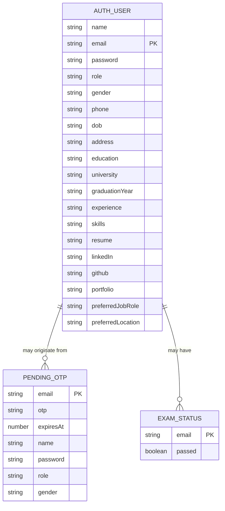

# AETHRIX AI ER Diagram

```mermaid
erDiagram
    AUTH_USER {
        string name
        string email PK
        string password
        string role
        string gender
        string phone
        string dob
        string address
        string education
        string university
        string graduationYear
        string experience
        string skills
        string resume
        string linkedIn
        string github
        string portfolio
        string preferredJobRole
        string preferredLocation
    }
    PENDING_OTP {
        string email PK
        string otp
        number expiresAt
        string name
        string password
        string role
        string gender
    }
    EXAM_STATUS {
        string email PK
        boolean passed
    }

    AUTH_USER ||--o{ PENDING_OTP : "may originate from"
    AUTH_USER ||--o{ EXAM_STATUS : "may have"
```
